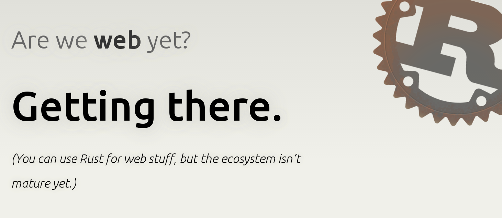
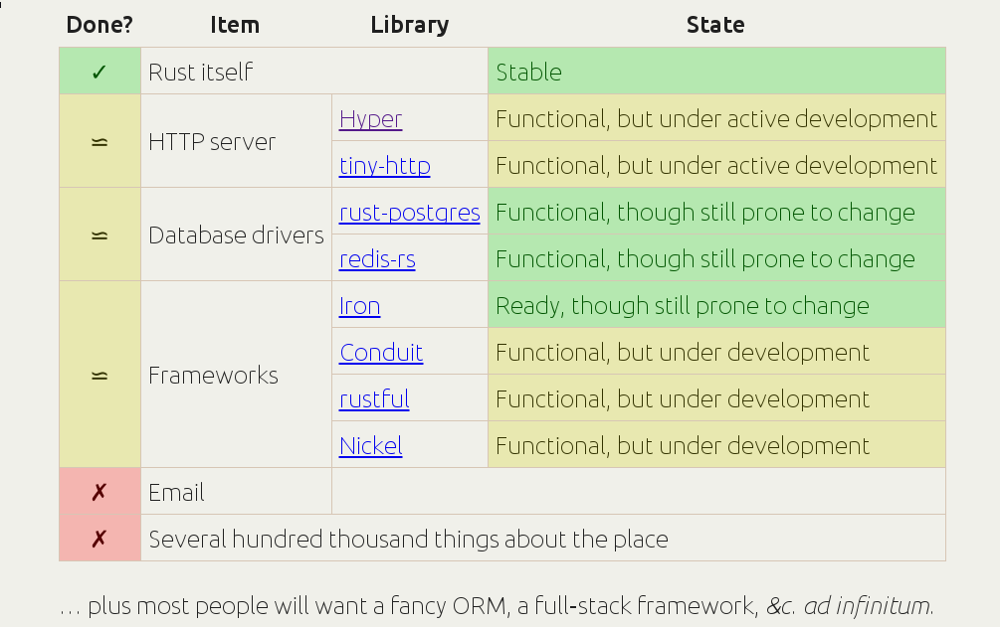

# Networking & Web

### CIS 198 Lecture 9

---
## Networking

---
### Sockets

- Most of this section is preface.
- We're not actually going to cover most of what's in it directly.

---
### Sockets

- A basic way to send data over the network.
    - Not to be confused with IPC sockets, which are a Unix thing.
- Abstractly, a socket is just a channel that can send and/or receive data over
    some network.
- Many layers of socket-programming providers:
    - Operating system-provided system calls.
    - Low-level/low-abstraction programming language standard library.
    - Higher-level networking libraries or libraries handling a specific
      protocol (e.g. HTTP).
- Usually, you won't use sockets directly unless you want to do some
    low-level networking.
- Two general types: datagram & stream.

---
### Datagram Sockets (UDP)

- **U**ser **D**atagram **P**rotocol sockets
- Stateless: no connection to establish with another network device.
    - Simply send data to a destination IP and port, and assume they're
        listening.
- "At least once" delivery.
    - Packets are not guaranteed to be delivered in order.
    - Packets may be received more than once.
- Traditionally implement two methods:
    - send_to(addr) -- sends data over the socket to the specified address
    - recv_from() -- listens for data being sent to the socket

---
### `std::net::UdpSocket`

```rust
// Try to bind a UDP socket
let mut socket = try!(UdpSocket::bind("127.0.0.1:34254"));

// Try to receive data from the socket we've bound
let mut buf = [0; 10];
let (amt, src) = try!(socket.recv_from(&mut buf));

// Send a reply to the socket we just received data from
let buf = &mut buf[..amt];
buf.reverse();
try!(socket.send_to(buf, &src));

// Close the socket
drop(socket);
```

&sup1;Taken from the Rust docs.

---
### Stream Sockets (TCP)

- "This is where the drugs kick in" - Matt Blaze on TCP sockets
- **T**ransmission **C**ontrol **P**rotocol sockets
- Stateful: require a connection to be established and acknowledged between two
    clients (using SYN packet).

    - Connection must also be explicitly closed.
- Packets are delivered in-order, exactly once.
    - Achieved via packet sequence numbers.
- Packets have delivery acknowledgement (ACK packet).
- Generally two types of TCP socket:
    - TCP listeners: listen for data
    - TCP streams: send data

---
### `std::net::TcpStream`

- A TCP stream between a local socket and a remote socket.

```rust
// Create a TCP connection
let mut stream = TcpStream::connect("127.0.0.1:34254").unwrap();

// Uses std::io::{Read, Write}

// Try to write a byte to the stream
let write_result = stream.write(&[1]);

// Read from the stream into buf
let mut buf = [0; 128];
let read_result = stream.read(&mut buf);

// ...
// Socket gets automatically closed when it goes out of scope
```

---
### `std::net::TcpListener`

- A TCP socket server.

```rust
let listener = TcpListener::bind("127.0.0.1:80").unwrap();

fn handle_client(stream: TcpStream) { /* ... */  }

// Accept connections and process them,
// spawning a new thread for each one.
for stream in listener.incoming() {
    match stream {
        Ok(stream) => {
            thread::spawn(move|| {
                // connection succeeded
                handle_client(stream)
            });
        }
        Err(e) => { /* connection failed */ }
    }
}

// close the socket server
drop(listener);
```

---
### `SocketAddr`

- A socket address representation.
- May be either IPv4 or IPv6.
- Easily created using...

---
### `ToSocketAddrs`

```rust
pub trait ToSocketAddrs {
    type Iter: Iterator<Item=SocketAddr>;
    fn to_socket_addrs(&self) -> Result<Self::Iter>;
}
```

- A trait for objects which can be converted into `SocketAddr` values.
- Methods like `TcpStream::connect(addr: A)` specify that `A: ToSocketAddr`.
    - This makes it easier to specify what may be converted to a socket
        address-like object.
- See the docs for the full specification.

---
## [Web](http://arewewebyet.com/)



---
## [Web](http://arewewebyet.com/)



---
### HTTP - Preface

- HTTP defines several common methods for interacting with servers & clients
    over the Internet
- Common HTTP verbs are:
    - GET: retrieve data (e.g. access a web page)
    - POST: send data (e.g. submit a login form)
    - PATCH: modify existing data (e.g. modify a user profile)
    - DELETE: delete data (e.g. delete a user)
- Others exist, but are less common

---
### HTTP - Preface

- An HTTP _request_ is made by sending some data to a server over HTTP
    containing some data, such as:
    - the URL of the server
    - the method you want to invoke
    - data the server needs to look at (like in a POST)
    - names of data you want back from the server
    - etc.

---
### HTTP - Preface

- Once the server processes your request, you get a _response_
- Responses usually contain:
    - a status code (200, 404, 502, etc.)
    - some information pertaining to your request:
        - HTML content
        - JSON-formatted data
        - Error messages
        - etc.

---
### [Hyper](http://hyper.rs)

- "A Modern HTTP library for Rust"
- Provides a relatively low-level wrapper over raw HTTP.
    - (Examples below won't run on the Rust Playpen since they require `extern
    crate`s)
- Because you never want to implement the HTTP protocol yourself.

---
### `hyper::client`

- An HTTP client.
- Designed for most people to make HTTP requests, using the `client::Request`
    API.

```rust
let client = Client::new();

// GET
let res = client.get("http://cis.upenn.edu/~cis198")
                .send().unwrap();
assert_eq!(res.status, hyper::Ok);

// POST
let res = client.post("http://cis.upenn.edu/~cis198")
                .body("user=me")
                .send().unwrap();
assert_eq!(res.status, hyper::Ok);

// PUT, PATCH, DELETE, etc. are all legal verbs too.
```

- `Client` is shareable between threads, so you can make requests _in parallel by default_!

---
### `Client` Requests

- Let's see some full client examples with proper error handling.
- A GET request that reads out the body of a web page:

```rust
extern crate hyper;

use std::io::Read;
use hyper::client::Client;

// GET
fn get_contents(url: &str) -> hyper::Result<String> {
    let client = Client::new();
    let mut response = try!(client.get(url).send());
    let mut buf = String::new();
    try!(response.read_to_string(&mut buf));
    Ok(buf)
}

println!("{}", get_contents("http://cis198-2016s.github.io/")
                .unwrap()); // A whole mess of HTML
```

&sup1;Adapted from Zbigniew Siciarz's [24 Days of Rust](http://zsiciarz.github.io/24daysofrust)

---
### `Client` Requests

- A POST request, using `form_urlencoded` from the `url` crate to do URL encoding:

```rust
extern crate hyper;
extern crate url;
use url::form_urlencoded;

// POST
fn post_query(url: &str, query: Vec<(&str, &str)>)
        -> hyper::Result<String> {
    let body = form_urlencoded::serialize(query);

    let client = Client::new();
    let mut response = try!(client.post(url).body(&body[..]).send());
    let mut buf = String::new();
    try!(response.read_to_string(&mut buf));
    Ok(buf)
}

let query = vec![("user", "me"), ("email", "me@email.email")];
println!("{}", post_query("http://httpbin.org/post", query)
    .unwrap());
```

---
### `Client` Requests

- Using `rustc_serialize`, we can generalize our POST request encoding to allow
    any data that's encodable to JSON!

```rust
extern crate rustc_serialize;
use rustc_serialize::{Encodable, json};

fn post_json<T: Encodable>(url: &str, payload: &T)
        -> hyper::Result<String> {
    let body = json::encode(payload).unwrap();

    // same as before from here
}
```

---
### `hyper::server`

- An HTTP server that listens on a port, parses HTTP requests, and passes them
    to a handler.
- `Server` listens to multiple threads by default.
- You must define a `Handler` for `Server` to define how it handles requests.

```rust
use hyper::{Server, Request, Response};

fn hello(req: Request, res: Response) {
    res.send(b"Hello World!").unwrap();
}

Server::http("127.0.0.1:3000").unwrap().handle(hello).unwrap();
```

---
### `hyper::server::Handler`

- `Handler` is a trait that defines how requests will be handled by the server.
- It only requires one method, `handle`, which just takes a `Request` and a
    `Response` and does something to them.
    - (It actually defines 3 more methods, but they all have default
        implementations.)

